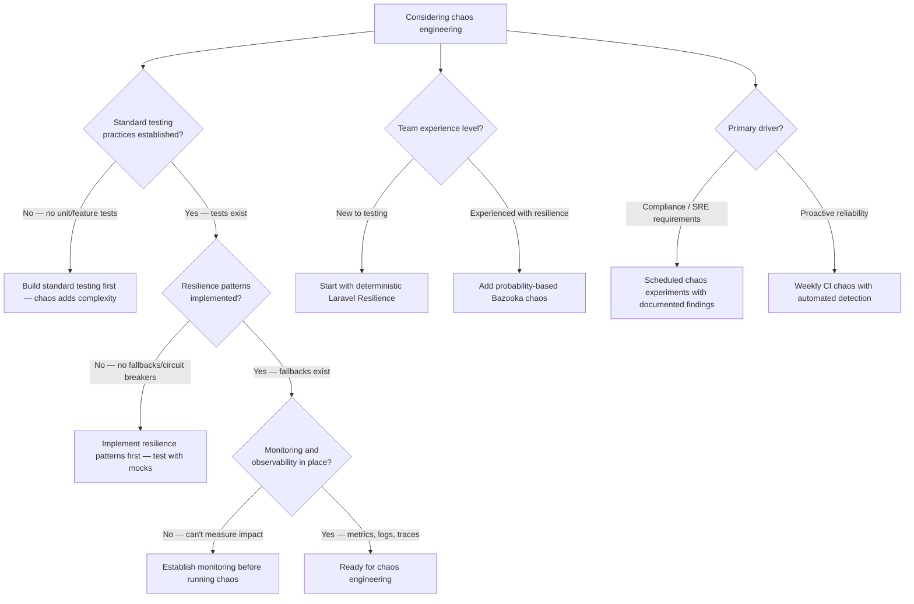

# Decision Trees

## Domain: Testing & Reliability Engineering
## Subdomain: Resilience & Chaos Engineering
## Knowledge Unit: Chaos Engineering Concepts

---

### Tree 1: When to Apply Chaos Engineering



**Key decision points:**
- **Prerequisites**: Standard testing → resilience patterns → monitoring → chaos engineering. Don't skip layers.
- **Team experience**: New teams start with deterministic fault injection. Experienced teams add probabilistic chaos.
- **Driver determines cadence**: Compliance → scheduled documented experiments. Proactive → automated CI chaos.

---

### Tree 2: Steady State → Hypothesis → Experiment Workflow

```mermaid
flowchart TD
    A[Run a chaos experiment] --> B[Define steady state — measure normal behavior]
    B --> C[Response time baseline, error rate baseline, throughput baseline]
    C --> D[Formulate hypothesis — "If X fails, Y should happen"]
    D --> E{Hypothesis testable?}
    E -->|Yes — specific, measurable| F[Proceed to experiment design]
    E -->|No — vague or unmeasurable| G[Refine hypothesis: be specific about expected behavior]
    F --> H[Design experiment — single fault, narrow blast radius]
    H --> I{Production or<br>staging?}
    I -->|Staging| J[Safest — validate hypothesis before production]
    I -->|Production (advanced)| K[Requires guardrails: blast radius limit, rollback plan, monitoring]
    A --> L[Inject fault]
    L --> M[Measure impact against hypothesis]
    M --> N{Hypothesis<br>confirmed?}
    N -->|Yes| O[Document: resilience confirmed. Consider expanding scope.]
    N -->|No — unexpected behavior| P[Document resilience gap. Fix fallback. Add automated test.]
    A --> Q[Add deterministic test for this scenario in main CI]
```

**Key decision points:**
- **Steady state first**: Measure normal behavior before injecting chaos. Without baseline, you can't quantify impact.
- **Testable hypothesis**: "If X fails, Y should happen" — specific, measurable, verifiable.
- **Staging before production**: Validate all experiments in staging first. Production experiments need guardrails.

---

### Tree 3: Chaos Engineering Tool Selection

```mermaid
flowchart TD
    A[Select chaos engineering tool] --> B{Injection type?}
    B -->|Deterministic — always inject fault| C[Laravel Resilience — per-method fault injection]
    B -->|Probabilistic — inject with probability| D[Laravel Bazooka — multi-point chaos experiments]
    A --> E{Testing level?}
    E -->|Unit — isolated class| F[Use Mockery/fakes for failure simulation]
    E -->|Feature — full stack| G[Laravel Resilience — decorates real container services]
    E -->|Integration — multi-service| H[Laravel Bazooka — chaos points across services]
    A --> I{Methodology phase?}
    I -->|Phase 1 — establish baseline| J[Laravel Resilience — deterministic tests for critical services]
    I -->|Phase 2 — explore unknowns| K[Add Laravel Bazooka — probability-based discovery]
    I -->|Phase 3 — continuous validation| L[Scheduled CI chaos with both tools]
    A --> M{Infrastructure level?}
    M -->|Application code only| N[Resilience or Bazooka — no infrastructure changes]
    M -->|Infrastructure (network, DB)| O[Infrastructure-level tools — tc, chaos monkey equivalents]
```

**Key decision points:**
- **Deterministic → probabilistic progression**: Start with Resilience (always fails). Add Bazooka (sometimes fails) later.
- **Level of testing**: Mockery for unit. Resilience for feature. Bazooka for multi-service integration.
- **Application vs infrastructure**: Application-level chaos uses Resilience/Bazooka. Infrastructure-level needs system tools.

---

### Tree 4: Adopting Chaos Engineering in a Team

```mermaid
flowchart TD
    A[Adopt chaos engineering in team] --> B{Team buy-in?}
    B -->|Skeptical — "chaos will break things"| C[Start with discovery mode — non-destructive]
    B -->|Enthusiastic — "let's break everything"| D[Install discipline: hypothesis, blast radius, documentation]
    C --> E[Run: php artisan resilience:discover]
    E --> F[Share findings: "Here are 12 services that could fail"]
    F --> G[Pair with service owners — identify critical paths]
    G --> H[Write one deterministic resilience test for a critical service]
    H --> I[Demo: "Resilience test caught this bug we didn't know about"]
    A --> J{Quarterly review<br>established?}
    J -->|Yes| K[Re-run discovery, review chaos points, update stale config]
    J -->|No| L[Schedule quarterly review — chaos config goes stale without it]
    A --> M{Culture building?}
    M -->|Share chaos wins| N["Chaos test found 3 untested fallback paths this month"]
    M -->|Blame-free postmortems| O[Chaos findings are opportunities, not failures]
    A --> P[Scale: more services, more disruption types, scheduled CI]
```

**Key decision points:**
- **Start non-threatening**: Discovery mode shows what can be tested without actually breaking anything.
- **Service owner involvement**: Pair with owners to identify critical paths and write meaningful tests.
- **Culture matters**: Chaos findings are opportunities. Blame-free environment encourages participation.
- **Quarterly review**: Code changes make chaos points stale. Re-run discovery and update quarterly.
