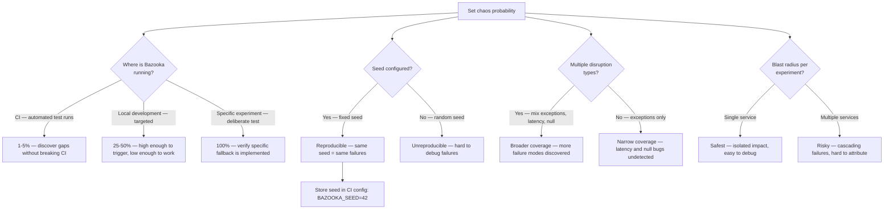

# Decision Trees

## Domain: Testing & Reliability Engineering
## Subdomain: Resilience & Chaos Engineering
## Knowledge Unit: Chaos Experiments with Laravel Bazooka

---

### Tree 1: Deterministic Fault Injection vs Chaos Engineering

```mermaid
flowchart TD
    A[Choose resilience testing approach] --> B{Primary goal?}
    B -->|Verify specific fallback path| C[Deterministic fault injection — Laravel Resilience]
    B -->|Discover unknown failure modes| D[Chaos engineering — Laravel Bazooka]
    A --> E{Test determinism needed?}
    E -->|Yes — tests must always pass/fail the same way| F[Laravel Resilience — 100% deterministic]
    E -->|No — probabilistic is acceptable| G[Laravel Bazooka — probability-based failures]
    A --> H{Resilience baseline<br>established?}
    H -->|Yes — deterministic tests pass| I[Add Bazooka for exploratory chaos]
    H -->|No — no resilience baseline| J[Start with Laravel Resilience first]
    A --> K{Environment?}
    K -->|CI — must be predictable| L[Resilience in main CI, Bazooka in separate scheduled job]
    K -->|Development — exploratory| M[Bazooka at moderate probability (25-50%)]
```

**Key decision points:**
- **Deterministic first, chaos second**: Establish baseline resilience with deterministic tests. Add chaos for exploration.
- **CI placement**: Deterministic → main CI. Chaos → separate scheduled workflow.
- **Bazooka alone is insufficient**: Always pair with deterministic fault injection for comprehensive resilience testing.

---

### Tree 2: Probability Configuration — CI vs Local vs Experiment



**Key decision points:**
- **CI probability**: 1-5% — low enough for reliable CI, high enough to discover issues over multiple runs.
- **Seed for reproducibility**: Always use fixed seeds in CI. Without seeds, chaos failures can't be reproduced.
- **Mix disruption types**: Exceptions aren't the only real-world failure. Test latency, null returns, empty responses.

---

### Tree 3: CI Strategy — Separate Scheduled Workflow

```mermaid
flowchart TD
    A[Add Bazooka to CI pipeline] --> B{Primary workflow or<br>separate job?}
    B -->|Separate scheduled workflow| C[Recommended — weekly/nightly, non-blocking]
    B -->|Same as main tests| D{Risk: probability failures<br>block PRs randomly}
    D -->|Non-blocking (informational)| E[Acceptable — failures tracked but don't block]
    D -->|Blocking| F[Avoid — team will disable chaos]
    C --> G[cron: '0 6 * * 1' — Monday 6AM]
    G --> H[Steps: checkout, setup, discover, test with BAZOOKA_ENABLED=true]
    H --> I[Env: BAZOOKA_SEED=42, BAZOOKA_ENABLED=true]
    I --> J[Run: php artisan test --filter=Resilience]
    J --> K{Test failures?}
    K -->|Chaos-caused — log confirms| L[Improve fallback handling — document gap]
    K -->|Regression — no chaos log| M[Fix regression — chaos found a real bug]
    A --> N{Logging configured<br>for attribution?}
    N -->|Yes — every injection logged| O[Can distinguish chaos failure from real regression]
    N -->|No — no logging| P[Mandatory: add logging — every failure is a mystery without it]
```

**Key decision points:**
- **Separate workflow**: Chaos in a non-blocking scheduled job. Never in the PR-blocking pipeline.
- **Logging for attribution**: Distinguish "expected chaos failure" from "real regression" through logging.
- **Weekly cadence**: Frequent enough to catch issues, infrequent enough to avoid noise.

---

### Tree 4: Designing a Chaos Experiment

```mermaid
flowchart TD
    A[Design a chaos experiment] --> B[Identify target service — payment, auth, email, cache]
    B --> C[Define hypothesis — "When X fails, Y happens"]
    C --> D{Blast radius scope?}
    D -->|Single method on one service| E[Narrow — safest, clearest results]
    D -->|Multiple methods on one service| F[Medium — acceptable if related]
    D -->|Multiple services| G[Broad — only after narrow tests pass]
    A --> H[Configure disruption type and value]
    H --> I[Exception: specify exception class to throw]
    I --> J[Latency: specify delay in milliseconds]
    J --> K[Null/Empty/Random: specify return type]
    A --> L[Run experiment]
    L --> M{Does result match<br>hypothesis?}
    M -->|Yes — fallback works| N[Document success — resilience confirmed]
    M -->|No — unexpected behavior| O[Investigate — resilience gap found]
    O --> P[Fix fallback code or add missing handling]
    P --> Q[Add deterministic test: Resilience::fake() for this scenario]
    A --> R[Repeat with different disruption types and expanded scope]
```

**Key decision points:**
- **Hypothesis required**: Every experiment needs a clear hypothesis. "Let's see what happens" is insufficient.
- **Blast radius**: Start narrow (single method). Expand only after narrow tests pass.
- **Findings → automated tests**: Every discovered resilience gap gets a deterministic Resilience test that runs in main CI.
