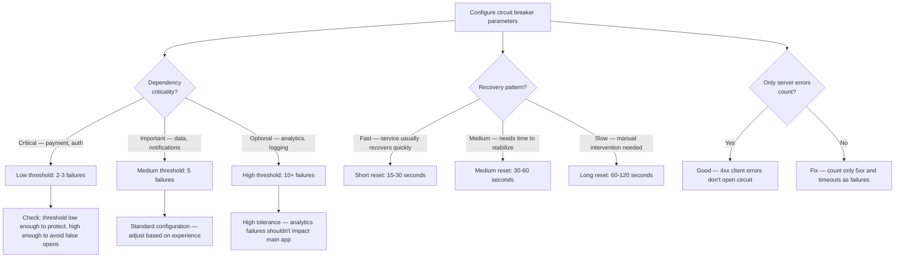

# Decision Trees

## Domain: Testing & Reliability Engineering
## Subdomain: Resilience & Chaos Engineering
## Knowledge Unit: Circuit Breaker Patterns

---

### Tree 1: Circuit Breaker vs Simple Retry

```mermaid
flowchart TD
    A[Choose between retry and circuit breaker] --> B{Failure pattern?}
    B -->|Transient — rare, short-lived| C[Use simple retry — exponential backoff]
    B -->|Sustained — service down for minutes/hours| D[Use circuit breaker — fail fast, prevent cascading]
    A --> E{Operation type?}
    E -->|Read — cached data available as fallback| F[Circuit breaker + cached fallback]
    E -->|Write — must succeed or fail| G{Idempotent?}
    G -->|Yes| H[Retry with backoff — will succeed when service recovers]
    G -->|No| I[Circuit breaker + queue for later retry]
    A --> J{Cost of calling the<br>dependency?}
    J -->|Expensive (time/resources)| K[Circuit breaker — avoid hitting failing service]
    J -->|Cheap| L[Retry may be acceptable — low cost per attempt]
```

**Key decision points:**
- **Transient vs sustained**: Retries handle brief failures. Circuit breakers protect against prolonged outages.
- **Read vs write**: Reads can fall back to cache. Writes need idempotency or queuing.
- **Cost of calls**: Expensive dependencies justify circuit breaker protection even for transient failures.

---

### Tree 2: Configuring Failure Threshold and Reset Timeout



**Key decision points:**
- **Criticality determines threshold**: Critical = low threshold. Optional = high threshold.
- **Recovery speed determines reset**: Fast recovery = short reset. Slow = long reset.
- **Failure counting**: Only server errors (5xx) and timeouts should open the circuit.

---

### Tree 3: Fallback Strategy Selection

```mermaid
flowchart TD
    A[Choose fallback strategy] --> B{Data type?}
    B -->|Read data — API response, user data| C[Cached fallback — serve stale but safe data]
    B -->|Write — create/update operation| D[Queue for retry — don't lose the operation]
    B -->|Computation — report, calculation| E[Default value — compromise on accuracy]
    A --> F{Staleness acceptable?}
    F -->|Yes — data changes slowly| G[Cached data is ideal — stale data is better than no data]
    F -->|No — real-time data critical| H[Return degraded response — "data temporarily unavailable"]
    A --> I{User experience<br>goal?}
    I -->|Transparent degradation| J[Return cached/default data — user may not notice]
    I -->|Informative degradation| K[Show degraded mode message — user knows feature is limited]
    A --> L{Fallback tested?}
    L -->|Yes| M[Good — resilience tests validate fallback behavior]
    L -->|No| N[Write fallback test immediately — untested fallback is not a fallback]
```

**Key decision points:**
- **Data type**: Read → cache. Write → queue. Computation → default.
- **Staleness tolerance**: Acceptable staleness → cached data. Must be fresh → degraded message.
- **Test the fallback**: No fallback test = no confidence the fallback actually works.

---

### Tree 4: Storage Selection — Redis vs Database

```mermaid
flowchart TD
    A[Choose circuit state storage] --> B{Application<br>architecture?}
    B -->|Single server| C[Database storage — sufficient, simpler dependency]
    B -->|Multiple servers (distributed)| D[Redis — atomic state across all servers]
    A --> E{Concurrency?}
    E -->|Low — <100 req/s| F[Database may suffice — race conditions unlikely]
    E -->|High — 100+ req/s| G[Redis required — atomic operations prevent race conditions]
    A --> H{Redis already in<br>use?}
    H -->|Yes| I[Use Redis — no new infrastructure]
    H -->|No| J{Circuit breaker is<br>critical?}
    J -->|Yes| K[Add Redis — critical resilience infrastructure]
    J -->|No — optional| L[Database — simpler, no new dependency]
    A --> M{State reset on<br>deploy?}
    M -->|Yes| N[Include in deployment: php artisan circuit-breaker:reset]
    M -->|No| O[Add — previously open circuits stale after deploy]
```

**Key decision points:**
- **Single vs multi-server**: Single server = database is fine. Multi-server = Redis for consistency.
- **Concurrency**: Redis atomic operations prevent race conditions. Database may cause inconsistent states.
- **State reset**: Always reset circuit states during deployments. Previously open circuits remain open after fixes.
