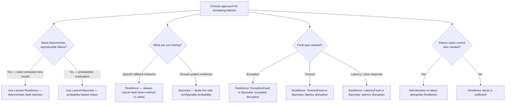

# Decision Trees

## Domain: Testing & Reliability Engineering
## Subdomain: Resilience & Chaos Engineering
## Knowledge Unit: Fault Injection Testing with Laravel Resilience

---

### Tree 1: Fault Injection Tool Selection



**Key decision points:**
- **Deterministic vs probabilistic**: Resilience always fails the same way. Bazooka fails with configurable probability.
- **Return value control**: Resilience doesn't control return values. Add Mockery/fakes if needed.
- **Fault types**: Both tools support exceptions and latency. Match the fault type to the real failure mode.

---

### Tree 2: Workflow Progression — Discovery → Scaffold → Test

```mermaid
flowchart TD
    A[Start resilience testing] --> B[Run: php artisan resilience:discover]
    B --> C[Review discovered services — document findings]
    C --> D{Service has fallback<br>code implemented?}
    D -->|Yes| E[Run: php artisan resilience:scaffold --service=ServiceName]
    D -->|No| F[Implement fallback first — resilience tests without fallback are noise]
    E --> G[Review generated test templates]
    G --> H{Customize assertions<br>for meaningful validation?}
    H -->|Yes| I[Add: assertFallbackUsed(), assertDegradedButSuccessful(), response content checks]
    H -->|No — defaults| J[Defaults provide basic coverage but miss specific fallback verification]
    I --> K[Run: php artisan test --filter=Resilience]
    J --> K
    K --> L{Tests pass?}
    L -->|Yes — fallback verified| M[Commit: resilience confirmed for the service]
    L -->|No — fallback not found| N[Check: is fallback code correct? Is assertion valid?]
    A --> O[Schedule quarterly re-discovery — container bindings change]
```

**Key decision points:**
- **Prerequisite — fallback code must exist**: Never scaffold or test resilience without fallback code.
- **Customize assertions**: Default scaffolds are templates. Add specific assertions for meaningful validation.
- **Quarterly re-discovery**: Container bindings change over time. Re-run discovery periodically.

---

### Tree 3: Fault Type Selection — Exception vs Timeout vs Latency

```mermaid
flowchart TD
    A[Choose fault type for test] --> B{What real failure are<br>you simulating?}
    B -->|Service throws an error| C[ExceptionFault — throw specific exception]
    B -->|Service doesn't respond in time| D[TimeoutFault — delay beyond threshold]
    B -->|Service is degraded / slow| E[LatencyFault — add configurable delay]
    A --> F{Test performance<br>sensitive?}
    F -->|Yes — keep tests fast| G[ExceptionFault — ~0ms overhead]
    F -->|Moderate — latency acceptable| H[LatencyFault — use 50-100ms delay]
    F -->|No — need timeout path| I[TimeoutFault — use 100-200ms, not production 5s]
    A --> J{What fallback path?}
    J -->|Immediate fallback (cached data)| K[ExceptionFault — exercises fallback immediately]
    J -->|Degraded mode (slow but functional)| L[LatencyFault — verifies timeout with fallback]
    J -->|Queue retry path| M[TimeoutFault — exercises retry scheduling]
```

**Key decision points:**
- **Match fault to real failure**: Exception = crash. Timeout = no response. Latency = slow.
- **Short timeouts**: Use 100-200ms in tests, not production 5s. Same code path, faster tests.
- **Start with ExceptionFault**: Fastest (<0.1ms overhead). Add LatencyFault/TimeoutFault later for specific paths.

---

### Tree 4: CI Placement — Main Suite vs Separate Stage

```mermaid
flowchart TD
    A[Place resilience tests in CI] --> B{What fault types<br>are used?}
    B -->|ExceptionFault only| C[May run in main suite — <0.1ms overhead each]
    B -->|TimeoutFault or LatencyFault included| D[Run in separate CI stage]
    A --> E{How many resilience<br>tests?}
    E -->|Few (1-5) — exception only| F[Include in main suite — negligible overhead]
    E -->|Many (5+) — any fault type| G[Separate stage recommended]
    D --> H[Main: php artisan test --exclude-group=resilience]
    H --> I[Post-deploy: php artisan test --group=resilience]
    A --> J{Cleanup configured?}
    J -->|beforeEach clears faults| K[Safe — no cross-test contamination]
    J -->|No cleanup| L[Mandatory — add beforeEach to clear faults]
```

**Key decision points:**
- **Exception-only in main suite**: Fast enough for main CI. Timeout/latency faults need separate stage.
- **Test count matters**: Few exception tests (<5) OK in main suite. Many tests → separate stage.
- **Cleanup is mandatory**: Cross-test fault contamination causes unpredictable failures. Always clear in beforeEach.
