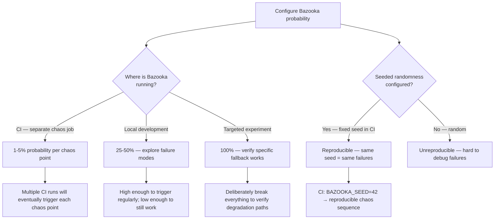
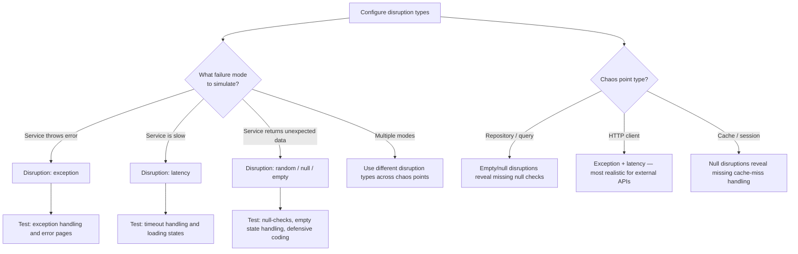

# Decision Trees

## Domain: Testing & Reliability Engineering
## Subdomain: Resilience & Chaos Engineering
## Knowledge Unit: Laravel Bazooka Chaos Engineering

---

### Tree 1: Bazooka vs Deterministic Fault Injection

```mermaid
flowchart TD
    A[Choose chaos approach] --> B{Need deterministic,<br>reproducible failures?}
    B -->|Yes — test a specific fallback| C[Use Laravel Resilience — per-test fault injection]
    B -->|No — probabilistic exploration| D[Use Laravel Bazooka — random chaos injection]
    C --> E[Resilience: fault always fires for the specified method]
    D --> F[Bazooka: fault fires with configurable probability (1-100%)]
    A --> G{Test environment?}
    G -->|CI — must be reliable| H[Bazooka at 1-5% probability + separate job]
    G -->|Development — exploratory| I[Bazooka at 25-100% — find untested failure paths]
    A --> J{Primary goal?}
    J -->|Validate specific fallback| K[Resilience — fast, deterministic, targeted]
    J -->|Discover unknown failure modes| L[Bazooka — broad, exploratory, probabilistic]
```

**Key decision points:**
- **Deterministic vs probabilistic**: Resilience for known failure paths (always fails). Bazooka for exploration (sometimes fails).
- **CI probability**: 1-5% Bazooka probability in CI — enough to discover issues without making CI flaky.
- **Combination**: Use both — Resilience for targeted tests, Bazooka for exploratory chaos.

---

### Tree 2: Setting Chaos Probability Levels



**Key decision points:**
- **Environment determines probability**: CI = low (1-5%). Dev = moderate (25-50%). Experiment = high (100%).
- **Seeded randomness**: Always use a fixed seed in CI for reproducibility. Same seed = same chaos sequence.
- **Without seed**: Failures are non-reproducible — hard to debug.

---

### Tree 3: Chaos CI Strategy — Separate Job Setup

```mermaid
flowchart TD
    A[Add Bazooka to CI] --> B{Where in pipeline?}
    B -->|Separate CI workflow| C[Recommended — weekly or nightly]
    B -->|Same workflow as tests| D{Risk: random failures<br>block PRs}
    D -->|Low probability + non-blocking| E[Acceptable if failures don't block]
    D -->|Blocking| F[Avoid — team will disable chaos]
    C --> G[scheduled: cron '0 6 * * 1' — Monday morning]
    G --> H[env: BAZOOKA_ENABLED=true, BAZOOKA_SEED=42]
    H --> I[Run full test suite with chaos enabled]
    I --> J{Test failures?}
    J -->|Chaos-caused (check logs)| K[Improve fallback handling]
    J -->|Real regression| L[Fix regression — chaos found a bug]
    A --> M{Logging configured?}
    M -->|Yes| N[Attribution: chaos-caused vs regression]
    M -->|No| O[Mandatory — without logging, every failure is a mystery]
```

**Key decision points:**
- **Separate workflow**: Chaos runs non-blocking weekly/nightly. Never in the PR-blocking pipeline.
- **Logging**: Every chaos injection must be logged. Without logging, chaos failures are indistinguishable from regressions.
- **Findings**: Chaos test failures are opportunities — either improve fallbacks or fix regressions.

---

### Tree 4: Choosing Disruption Types



**Key decision points:**
- **Mix disruption types**: Exceptions, latency, random values, and null returns each test different code paths.
- **Match disruption to chaos point**: Repositories need null/empty. HTTP clients need exceptions/latency.
- **Comprehensive coverage**: Multiple disruption types across multiple chaos points provide the most value.
