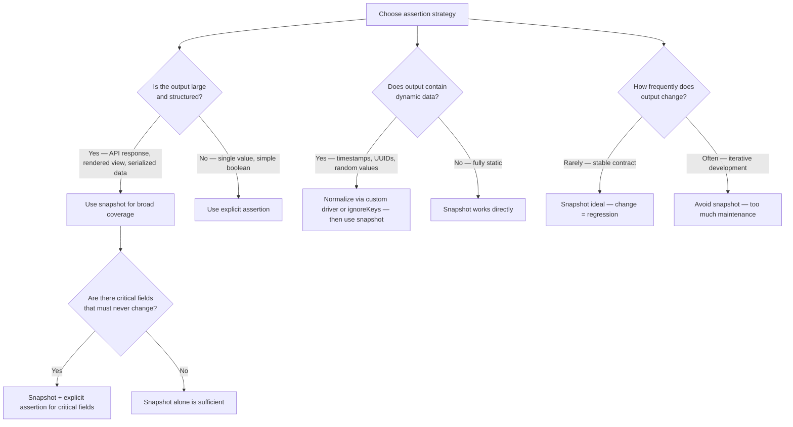
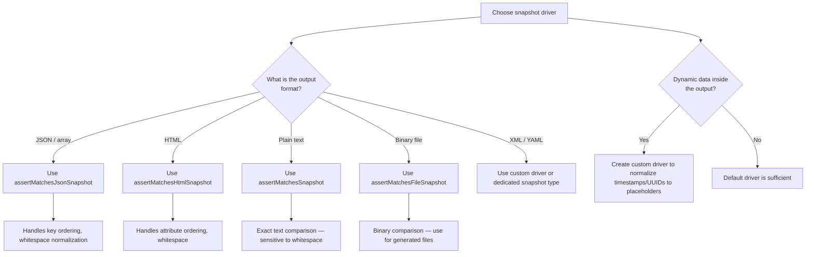
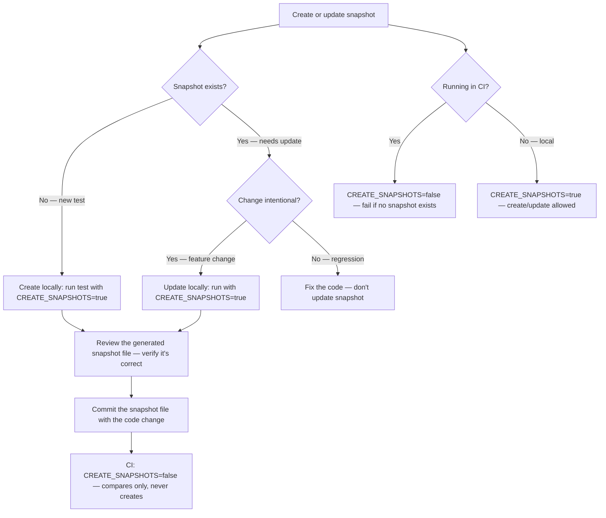

# Decision Trees

## Domain: Testing & Reliability Engineering
## Subdomain: Snapshot Testing
## Knowledge Unit: Snapshot Testing with Spatie

---

### Tree 1: Snapshot vs Explicit Assertions — Which to Use



**Key decision points:**
- **Large/structured vs simple**: Snapshots for broad, multi-field output. Explicit assertions for individual values.
- **Critical fields**: Always pair snapshots with explicit assertions for values that must never change without review.
- **Stability**: Snapshots work best for stable outputs. Frequently changing outputs create maintenance burden.

---

### Tree 2: Which Snapshot Driver to Use



**Key decision points:**
- **Match driver to format**: JSON for JSON/arrays, HTML for views, text for plain strings, file for binaries.
- **Wrong driver = false failures**: Using text driver for JSON causes ordering/whitespace failures.
- **Dynamic data**: Create custom drivers to normalize dynamic values to stable placeholders.

---

### Tree 3: Snapshot Creation Workflow



**Key decision points:**
- **Local creation only**: Snapshots are always created locally, never in CI.
- **Review before commit**: Always inspect the generated snapshot file before committing.
- **CI behavior**: `CREATE_SNAPSHOTS=false` — CI fails if snapshot is missing, never creates one.

---

### Tree 4: Handling Dynamic Data in Snapshots

```mermaid
flowchart TD
    A[Handle dynamic data in snapshots] --> B{What type of<br>dynamic data?}
    B -->|Timestamps| C[Normalize to {TIMESTAMP} placeholder in custom driver]
    B -->|UUIDs| D[Normalize to {UUID} placeholder]
    B -->|Random values| E[Normalize to {RANDOM} or mock at source]
    B -->|Sequential IDs| F[Normalize to {ID} — IDs change per test run]
    A --> G{Custom driver or<br>ignoreKeys?}
    G -->|Simple exclusions (few keys)| H[Use ignoreKeys — built-in, less code]
    G -->|Complex transforms (many keys)| I[Create custom driver — reusable across tests]
    A --> J{Will dynamic data ever<br>be asserted?}
    J -->|Yes — format verification| K[Keep one dynamic value; add explicit assertion for format]
    J -->|No — always ignore| L[Always normalize — no value in asserting dynamic content]
```

**Key decision points:**
- **Type of dynamic data**: Timestamps, UUIDs, random values, and IDs each need normalization.
- **`ignoreKeys` vs custom driver**: Use `ignoreKeys` for simple exclusions. Create custom drivers for complex/reusable transforms.
- **Format verification**: If dynamic data format matters (e.g., ISO 8601), keep one example with explicit assertion + normalize others.
