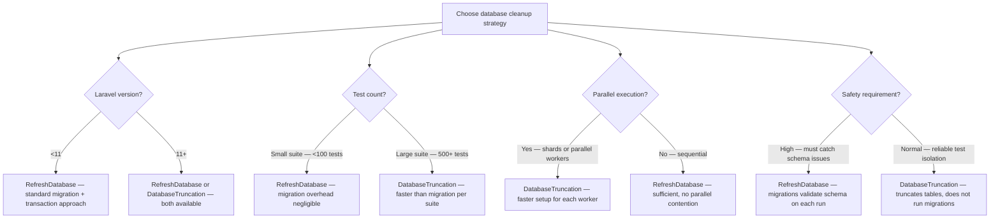

# Decision Trees

## Domain: Testing & Reliability Engineering
## Subdomain: Test Data Management
## Knowledge Unit: Test Data Cleanup (Minimal Data Principle)

---

### Tree 1: Record Count Decision Guide

```mermaid
flowchart TD
    A[Decide how many records to create] --> B{What behavior is<br>being tested?}
    B -->|Existence check — "it works"| C[1 record — minimum viable data]
    B -->|Ownership check — "user sees own X"| D[2 records — one owned, one not]
    B -->|Scope check — "filter by status"| E[3 records — two in scope, one out]
    B -->|Pagination check| F[(per_page + 1) records — enough for 2 pages]
    B -->|Sorting check| G[3-5 records — with diverse sort values]
    B -->|Authorization check — "role-based access"| H[2-3 records — different roles/users]
    A --> I{Creating more than<br>10 records?}
    I -->|No — stay under 10| J[Standard — no justification needed]
    I -->|Yes — 10+ records| K[Comment required — explain why this many is needed]
    A --> L{Data creation time<br>monitored?}
    L -->|Yes — profiling data collected| M[Optimize if data creation is significant portion of test time]
    L -->|No — not tracked| N[Start profiling — data creation may be bottleneck]
```

**Key decision points:**
- **1 record for existence**: Minimum viable. Most common case.
- **2 records for ownership**: One owned, one not. Clear boundary verification.
- **3 records for scoping**: Two in scope, one out. Verifies filter correctness.
- **10+ records requires comment**: Forces justification. Prevents data bloat.

---

### Tree 2: Explicit Values vs Faker Defaults

```mermaid
flowchart TD
    A[Choose data source for test attributes] --> B{Field used in<br>assertion?}
    B -->|Yes — asserted value| C[Use explicit fixed value — test@example.com, 'Admin']
    B -->|No — not asserted| D[Faker default OK — field is not verified]
    A --> E{Field affects<br>behavior?}
    E -->|Yes — email format affects routing| F[Use explicit value — control the behavior-triggering field]
    E -->|No — passive field, no logic impact| G[Faker default acceptable — behavior is independent of value]
    A --> H{Random data risk?}
    H -->|High — Faker may generate edge cases| I[Always explicit — special characters, dots, plus signs in email]
    H -->|Low — simple string or integer| J[Faker default acceptable — predictable output]
    A --> K{Example?}
    K -->|Email in assertion| L[User::factory()->create(['email' => 'test@example.com'])]
    K -->|Name in view assertion| M[User::factory()->create(['name' => 'Test User'])]
    K -->|Unasserted field (e.g., bio)| N[User::factory()->create() — Faker default for unasserted fields]
```

**Key decision points:**
- **Asserted fields → explicit values**: Deterministic, predictable, no edge-case failures.
- **Non-asserted fields → Faker**: OK for fields not verified in assertions.
- **Behavior-affecting fields → explicit**: Email format, role, status — always explicit.

---

### Tree 3: Cleanup Strategy — RefreshDatabase vs DatabaseTruncation



**Key decision points:**
- **RefreshDatabase**: Runs migrations + wraps in transaction. Thorough but slower.
- **DatabaseTruncation (Laravel 11+)**: Truncates all tables. Faster but doesn't validate migrations.
- **Safety vs speed**: RefreshDatabase for schema validation. DatabaseTruncation for faster execution.

---

### Tree 4: Profiling Data-Heavy Tests

```mermaid
flowchart TD
    A[Profile test data creation] --> B{Use --profile flag?}
    B -->|Yes — in CI| C[Collect per-test timing data — identify slowest tests]
    B -->|No — not profiling| D[Start profiling — overhead is negligible (0.1%)]
    A --> E{Slowest test<br>is data-heavy?}
    E -->|Yes — data creation is bottleneck| F[Audit record count — are all records necessary?]
    E -->|No — slow due to business logic| G[Optimize business logic, not data setup]
    A --> H{Data-heavy test<br>identified?}
    H -->|50+ records created| I[Reduce to minimum — most tests need 1-3 records]
    H -->|Complex relationships with deep nesting| J[Simplify — reduce relationship depth, use fewer related models]
    H -->|Test has comment explaining record count| K[Evaluate — is the justification valid?]
    A --> L{Performance target?}
    L -->|Suite time budget (e.g., <10 min)| M[Track data creation time as part of budget]
    L -->|No budget| N[Set a budget — data-heavy tests will degrade without constraint]
```

**Key decision points:**
- **Profile first**: Use `--profile` to identify actual data bottlenecks. Don't guess.
- **Data-heavy = too many records**: Most tests need 1-3 records. Reduce if creating 50+.
- **Set time budget**: Without a budget, data creation grows unchecked over time.
