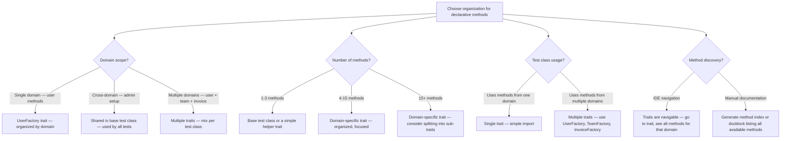

# Decision Trees

## Domain: Testing & Reliability Engineering
## Subdomain: Test Data Management
## Knowledge Unit: Test Data Seeding (Declarative Factory Methods)

---

### Tree 1: Inline Setup vs Declarative Method

```mermaid
flowchart TD
    A[Choose between inline and declarative method] --> B{Setup complexity?}
    B -->|1-3 lines — simple model creation| C[Inline — User::factory()->create() is clear enough]
    B -->|3-5 lines — moderate complexity| D[Consider extraction — especially if repeated]
    B -->|5+ lines — complex setup| E[Extract to declarative method — readability improves significantly]
    A --> F{Reusability?}
    F -->|Used in 1-2 tests| G[Inline — extraction overhead not justified for rare use]
    F -->|Used in 3+ tests| H[Extract — shared method reduces duplication and centralizes logic]
    A --> I{Readability impact?}
    I -->|Method name clarifies intent| J[Extract — createAdminUser() is clearer than 5 lines of chained factory calls]
    I -->|Method hides important details| K[Inline — keep setup visible to avoid hidden dependencies]
    A --> L{Method body exceeds<br>what it replaces?}
    L -->|Yes — longer than inline| M[Don't extract — inline is more concise]
    L -->|No — shorter or same length| N[Extract — method is net positive for readability]
```

**Key decision points:**
- **Extract when setup is 5+ lines or used in 3+ tests**: Threshold where extraction pays off.
- **Method must be shorter than inline**: If the method body is longer than inline, don't extract.
- **Method must clarify intent**: If the name doesn't clearly describe what's created, keep inline.

---

### Tree 2: Method Naming Convention

```mermaid
flowchart TD
    A[Choose method name] --> B{What does method<br>describe?}
    B -->|What is created — resulting state| C[createAdminUser() — describes the object's role]
    B -->|How it's created — implementation| D[Avoid — use "what" names, not "how" names]
    A --> E{Persisted or not?}
    E -->|Persisted — creates database record| F[Prefix with create: createAdminUser(), createTeam()]
    E -->|Not persisted — returns unsaved model| G[Prefix with make: makeAdminUser(), makeTeam()]
    A --> H{Multi-object return?}
    H -->|Yes — creates multiple related objects| I[Describe all objects in name: createTeamWithAdminAndMember()]
    H -->|No — single object return| J[Simple name: createAdminUser(), createSubscribedUser()]
    A --> K{Overrides needed?}
    K -->|Yes — callers need to customize| L[Add $overrides parameter: createAdminUser(array $overrides = [])]
    K -->|No — fixed creation| M[No parameters: createAdminUser()]
```

**Key decision points:**
- **"What" names**: `createAdminUser()` not `createUserWithAdminRole()`. Focus on result, not implementation.
- **create vs make**: `create` = persisted. `make` = not persisted. Established Laravel convention.
- **Multi-object names**: `createTeamWithAdminAndMember()` reveals all created objects in the name.

---

### Tree 3: Parameter Strategy — Fixed vs Configurable

```mermaid
flowchart TD
    A[Choose parameter strategy] --> B{Variations needed?}
    B -->|Few (1-2 variations)| C[Create separate methods — one per variation]
    B -->|Many (3+ variations)| D[Single parameterized method — with overrides array]
    A --> E{Parameter count?}
    E -->|0-2 parameters| F[Positional parameters — clear, simple]
    E -->|3+ parameters| G[Avoid — use $overrides array or separate methods]
    A --> H{Examples?}
    H -->|2 variations| I[createAdminUser() + createMemberUser() — separate methods]
    H -->|Many role variations| J[createUserWithRole(string $role) — parameterized]
    H -->|Many attribute variations| K[createUser(array $overrides = []) — overrides for rare scenarios]
    A --> L{Overrides position?}
    L -->|Last parameter| M[Standard — all optional parameters go last]
    L -->|First parameter| N[Avoid — callers must always provide it to use subsequent params]
```

**Key decision points:**
- **Few variations → separate methods**: `createAdminUser()` and `createMemberUser()`.
- **Many variations → parameterized**: `createUserWithRole(string $role)`.
- **Max 2-3 parameters**: Use `array $overrides = []` as the last parameter for exceptional cases.

---

### Tree 4: Organization — Trait vs Base Class



**Key decision points:**
- **Domain-specific traits**: Organize by domain. `UserFactory`, `TeamFactory`, `InvoiceFactory`.
- **Base class for truly shared methods**: `createAdminUser()` used by every test class.
- **Multiple traits per test class**: Mix and match as needed. Import only what's required.
